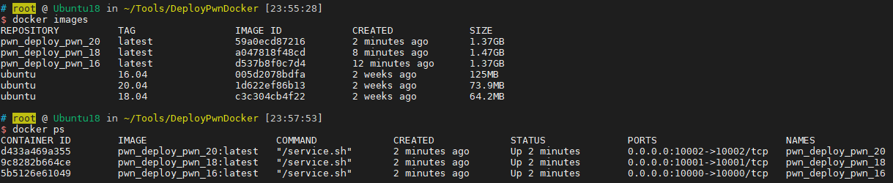

## DeployPwnDocker

Pwn调试环境搭建

### 参考：

- [https://github.com/giantbranch/pwn_deploy_chroot](https://github.com/giantbranch/pwn_deploy_chroot)
- [https://github.com/Eadom/ctf_xinetd](https://github.com/Eadom/ctf_xinetd)

### 使用

#### 搭建

```
python initialize.py
docker-compose up -d
```

运行`python initialize.py`后会根据bin中的文件名生成Dockerfile和xinetd

修改生成的Dockerfile文件来改变运行环境，或直接复制example文件夹里的文件

#### 单独运行容器

```
cd DeployPwnChroot/
./docker_run.sh {ubuntu版本} {端口}
```

进入DeployPwnChroot目录，docker_run.sh会将./bin映射在/root/work里

基本上只需要build一次，新文件放在bin目录里就可以了

### 环境

默认：`Python3 + Pwngdb + pwndbg`

可选：peda、gef

